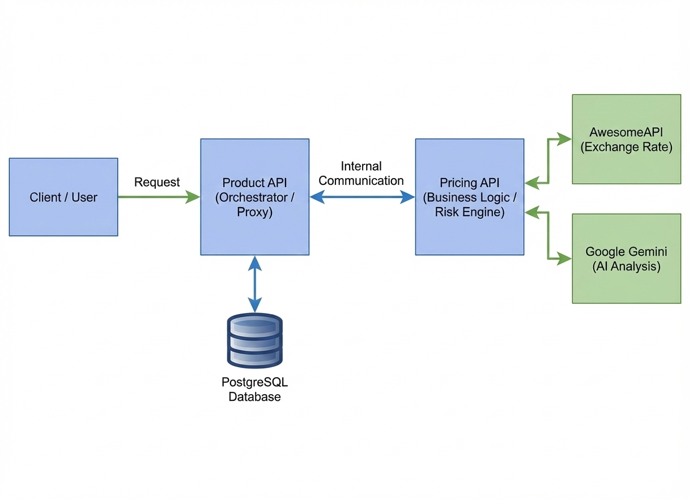

# 🌍 GlobalPrice - Product Microservice (Orchestrator)


> **MVP Project** developed for the Software Architecture postgraduate course at the Pontifical Catholic University of Rio de Janeiro (PUC-Rio).

> **Core Microservice** for the GlobalPrice architecture. Handles product catalog management, data persistence, and orchestrates real-time AI-driven pricing analysis.

## 📋 Project Description
GlobalPrice is a distributed system designed to solve currency volatility risks in international e-commerce.

**Architecture Pattern:** **Microservices (Scenario 2.1)**.
*   **This Component (Main API):** Acts as a Proxy and Orchestrator. It manages the product catalog database and delegates pricing logic to the Secondary API.
*   **Secondary Component (Pricing API):** Encapsulates business rules (spread calculation, smart rounding) and communicates with External Services (Exchange Rates & AI).

---

## 📂 Project Structure

```text
/globalprice-products-api
├── assets/             # 📸 Project documentation assets (diagrams, images)
│   └── architecture.png
├── app.py              # 🧠 Main application logic & Routes
├── models.py           # 🗄️ Database Schema (SQLAlchemy)
├── docker-compose.yml  # 🐳 Orchestration of all services
├── Dockerfile          # 🏗️ Container definition (Python 3.11)
├── requirements.txt    # 📦 Dependencies list
├── README.md           # 📖 Project documentation
└── .env.example        # 🔐 Secrets & Config (Must be edited to generate .env file)
```

---

## 🏗 Architecture Flowchart

The following diagram illustrates the **Scenario 2.1 Microservices Architecture**, highlighting the communication between the Orchestrator, the Business Logic Engine, and External Services.



---

## ✨ Key Features
- **Microservices Orchestration:** Uses Docker Compose to manage dependencies and networking.

- **Resilient Database:** Implements Healthchecks to prevent race conditions (waiting for Postgres to be fully ready).

- **Hybrid Persistence:** Automatically switches between PostgreSQL (Docker/Prod) and SQLite (Local/Dev).

- **Interactive Documentation:** Fully documented with Swagger UI.

- **AI Integration:** Connects with the Pricing Service to deliver AI-calculated profit margins based on market volatility.

---

## 🔌 External APIs Used

This project integrates with third-party public services:
1. AwesomeAPI (Currency Data)
 - Service: Real-time exchange rates.
 - License: Free for public use.
 - Routes Used: https://economia.awesomeapi.com.br/last/{coin}-{target}
2. Google Gemini (Artificial Intelligence)
 - Service: Generative AI for financial risk analysis.
 - Access: Requires API Key (Free Tier).
 - Model: Gemini 2.5 Flash.

---

## ⚙️ Installation & Execution
You can run this project using **Docker** *(Recommended)* or a **Local Environment** *(Python)*.

### Prerequisites

- **Git** installed.
- **[Docker Desktop](https://www.docker.com/)** installed and running *(Required for Method 1)*.
- **Python 3.11** *(for Local Environment - Method 2)*.
- A Google Gemini API Key (Get it free [here](https://aistudio.google.com/app/api-keys)).

### 🐳 Method 1: Docker Compose (Recommended)
This method automatically orchestrates the Database, the Pricing Service, and this API without requiring local Python configuration.

1.  **Clone the repositories:**
    Ensure both repositories are in the same parent directory.
    ```bash
    # Folder structure example:
    # /Projects
    #   ├── globalprice-products-api
    #   └── globalprice-pricing-api
    
    git clone https://github.com/GisellyOliveira/globalprice-products-api.git
    git clone https://github.com/GisellyOliveira/globalprice-pricing-api.git
    ```

### 2. Configure Environment
This project requires environment variables for Database credentials and the AI API Key. A template is provided in `.env.example`.

1.  **Create your local configuration file:**
    Copy the template to a new file named `.env`.
    ```bash
    cp .env.example .env   # Linux/Mac
    # copy .env.example .env # Windows CMD
    ```

2.  **Edit the `.env` file:**
    Open the newly created `.env` file and fill in the **required** fields (leave the others as default unless you have port conflicts).

    ```ini
    # Database Settings (REQUIRED)
    # Define credentials for the PostgreSQL container
    POSTGRES_USER=admin
    POSTGRES_PASSWORD=your_secure_password
    POSTGRES_DB=products_db

    # Network and Port Configurations (Optional - Defaults provided)
    PORT_MAIN=5000
    PORT_SEC=5001

    # Service URLs (Do not change if using Docker Compose)
    PRICING_SERVICE_URL=http://pricing_service:5000

    # API Key (REQUIRED for AI Risk Analysis)
    # Get your free key at: https://aistudio.google.com/app/apikey
    GEMINI_API_KEY=AIzaSyD...
    ```

3.  **Run the System:**
    ```bash
    cd globalprice-products-api
    docker-compose up --build
    ```
    *The system is ready when you see logs indicating `database system is ready` and `Running on http://0.0.0.0:5000`.*

---

### 🐍 Method 2: Local Environment (Manual)
Use this method if you want to develop or debug this specific service in isolation, using a local SQLite database.

1.  **Create Virtual Environment:**
    It is best practice to isolate dependencies.
    ```bash
    cd globalprice-products-api
    python -m venv venv
    
    # Activate:
    source venv/bin/activate  # Mac/Linux
    # .\venv\Scripts\activate # Windows
    ```

2.  **Install Dependencies:**
    ```bash
    pip install -r requirements.txt
    ```

3.  **Set Environment Variables (Optional):**
    If running locally without Docker, the app defaults to SQLite. To use Gemini AI, export the key:
    ```bash
    export GEMINI_API_KEY="YOUR_KEY" # Mac/Linux
    # set GEMINI_API_KEY="YOUR_KEY"  # Windows
    ```

4.  **Run Application:**
    ```bash
    python app.py
    ```
    *Access at: http://localhost:5000*

---

## 📖 API Documentation (Swagger)

Once the system is running, access the **Interactive Swagger UI** to test all endpoints visually without writing code:

👉 **[http://localhost:5000/apidocs](http://localhost:5000/apidocs)**

### 🔌 Available Endpoints

| Method | Endpoint | Description |
| :--- | :--- | :--- |
| `GET` | `/` | **Health Check:** Verifies if the API is running and healthy. |
| `GET` | `/products` | **List:** Retrieves all registered products from the database. |
| `POST` | `/products` | **Create:** Adds a new product to the catalog. |
| `GET` | `/products/{id}` | **Read:** Retrieves details of a specific product by its ID. |
| `PUT` | `/products/{id}` | **Update:** Modifies an existing product's data. |
| `DELETE` | `/products/{id}` | **Delete:** Removes a product from the database. |
| `GET` | `/products/{id}/price/{currency}` | **⭐ AI Integration:** Converts the product price to a target currency (e.g., USD, BTC, EUR) applying **AI-Driven Risk Analysis** and smart rounding. |